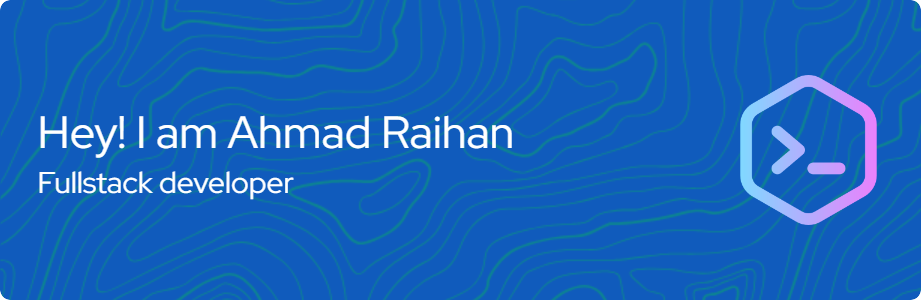

### 🙍‍♂️ About Me
Hi there! 👋 I’m Raihan, an Information Systems student passionate about web development and building user-centric digital solutions. Currently, I’m honing my skills in frontend development (HTML, CSS, JavaScript, React) and exploring backend technologies like Node.js and databases. I love turning ideas into functional projects and am always eager to collaborate, learn, and grow in the tech space. Let’s connect and create something awesome together!

### 📞 Connect With Me
   

### 🛠️ Tech Stack
                                   

### 📊 Github Stats

### Contributions
<picture>
  <source media="(prefers-color-scheme: dark)" srcset="https://raw.githubusercontent.com/Araihan413/Araihan413/output/pacman-contribution-graph-dark.svg">
  <source media="(prefers-color-scheme: light)" srcset="https://raw.githubusercontent.com/Araihan413/Araihan413/output/pacman-contribution-graph.svg">
  
</picture>
<!-- 
**Araihan413/Araihan413** is a ✨ _special_ ✨ repository because its `README.md` (this file) appears on your GitHub profile.

Here are some ideas to get you started:

- 🔭 I’m currently working on ...
- 🌱 I’m currently learning ...
- 👯 I’m looking to collaborate on ...
- 🤔 I’m looking for help with ...
- 💬 Ask me about ...
- 📫 How to reach me: ...
- 😄 Pronouns: ...
- ⚡ Fun fact: ...
 -->
